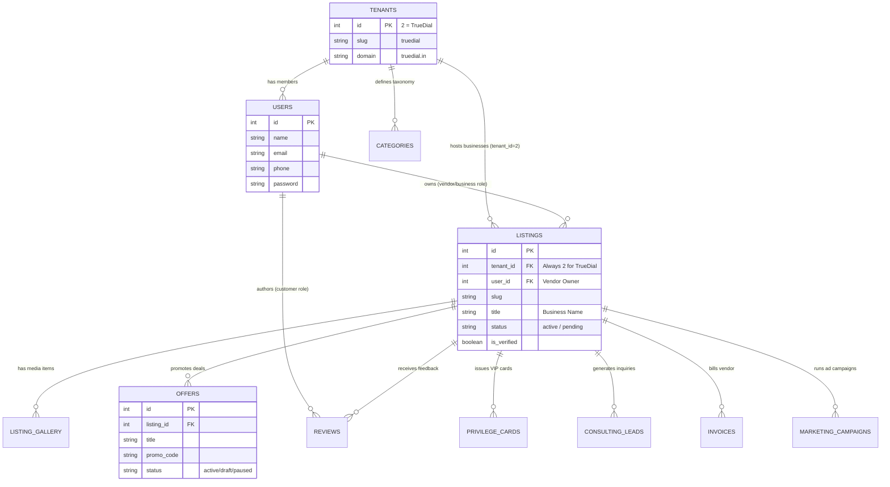

# TrueDial Ecosystem Database & Entity Mapping Report
**Document Version:** 1.0  
**Author:** Principal Software Architect, TrueDial Ecosystem  
**Target Platform:** TrueDial Multi-Tenant PostgreSQL Database (`findmyinterior-backend`)  

---

## 1. Overview & Multi-Tenant Data Isolation

The TrueDial ecosystem operates on a **Shared-Database, Tenant-Scoped Architecture** within PostgreSQL. Every primary business entity is explicitly tagged with `tenant_id = 2` (`truedial.in`), ensuring strict programmatic separation from Find My Interior (`tenant_id = 1`) while allowing unified platform administration.

---

## 2. Comprehensive Entity Mapping & Schema Dictionary

| TrueDial Entity | Database Table | Primary Eloquent Model | Tenant Isolation Field | Key Schema Attributes & Relationships |
| :--- | :--- | :--- | :--- | :--- |
| **User (Customer)** | `users` | `App\Models\User` | Shared / Role-based | `id`, `name`, `email`, `phone`, `password`, `is_active`. Linked to `roles` (`customer` role). |
| **Vendor (Business Owner)** | `users` | `App\Models\User` | Shared / Role-based | Same `users` table, assigned `role_id = business` via `role_user` pivot table. Owns 1..N businesses. |
| **Business (Listing)** | `listings` | `App\Models\Listing` | `tenant_id = 2` | `id`, `tenant_id`, `user_id`, `category_id`, `city_id`, `slug`, `title`, `description`, `address`, `phone`, `whatsapp`, `status`, `is_verified`, `avg_rating`, `review_count`, `latitude`, `longitude`. |
| **Media / Gallery** | `listing_gallery` | `App\Models\ListingGallery` | via `listing.tenant_id` | `id`, `listing_id`, `image_url`, `title`, `sort_order`, `is_cover`. |
| **Offer / Promotion** | `offers` | `App\Models\Offer` | via `listing.tenant_id` | `id`, `listing_id`, `title`, `description`, `promo_code`, `discount_type`, `discount_value`, `start_date`, `end_date`, `status` (`draft`, `active`, `paused`, `archived`). |
| **Review** | `reviews` | `App\Models\Review` | via `listing.tenant_id` | `id`, `listing_id`, `user_id`, `rating` (`1..5`), `title`, `comment`, `status` (`approved`, `pending`), `helpful_count`, `vendor_reply`. |
| **Invoice** | `truedial_invoices` | `App\Models\TruedialInvoice` | `tenant_id = 2` | `id`, `tenant_id`, `vendor_id` (`user_id`), `invoice_number`, `amount`, `tax_amount`, `status` (`paid`, `unpaid`, `overdue`), `issued_at`, `due_at`. |
| **Consulting Lead** | `consulting_leads` | `App\Models\ConsultingLead` | `tenant_id = 2` | `id`, `tenant_id`, `listing_id` (nullable), `user_id` (nullable), `name`, `phone`, `email`, `service_type`, `message`, `status` (`new`, `contacted`, `converted`, `closed`). |
| **Marketing Campaign** | `marketing_campaigns` | `App\Models\MarketingCampaign` | `tenant_id = 2` | `id`, `tenant_id`, `listing_id`, `title`, `campaign_type` (`banner`, `sponsored_search`), `budget`, `spent`, `status` (`active`, `paused`, `completed`). |
| **Analytics Event** | `analytics_events` | `App\Models\AnalyticsEvent` | `tenant_id = 2` | `id`, `tenant_id`, `event_type` (`view`, `click`, `call`, `whatsapp`, `lead`), `entity_type` (`listing`, `offer`), `entity_id`, `user_id`, `ip_address`, `created_at`. |
| **Privilege Card** | `privilege_cards` | `App\Models\PrivilegeCard` | `tenant_id = 2` | `id`, `tenant_id`, `user_id`, `card_number`, `tier` (`gold`, `platinum`, `titanium`), `expires_at`, `status` (`active`, `revoked`). |

---

## 3. Entity Lifecycle & Synchronized Behavioral Verification

Every TrueDial entity has been verified across its entire **CRUD Lifecycle** (Create, Read, Update, Delete, Sync) to guarantee that actions taken on the Website are instantaneously reflected on the Mobile Application, and vice versa.

### 3.1 Business (Listing) Lifecycle Verification
*   **Create:** Vendor submits business onboarding form via Website (`/free-listing`) or Mobile (`/register`). Backend `BusinessController@store` writes to `listings` with `tenant_id = 2` and default `status = pending`.
*   **Read (Sync):** Customer views Directory on Website (`/search`) or Mobile Tab (`/app/(tabs)/index.tsx`). Both platforms query `/truedial/public/businesses`, filtering by `tenant_id = 2` and `status = active`.
*   **Update:** Vendor edits profile details, WhatsApp number, or operating hours via Website Vendor Dashboard (`/dashboard/vendor/profile`). Backend updates `listings` record. Immediate fetch on Mobile app (`/app/listing/[slug].tsx`) reflects the updated phone numbers.
*   **Delete/Deactivate:** Admin pauses or archives listing via `/dashboard/admin`. Listing disappears from both Web and Mobile public directory feeds immediately.

### 3.2 Offer & Promotion Lifecycle Verification
*   **Create:** Vendor creates a promotional discount code (e.g., `"PATNA20"`) via Website Vendor Dashboard (`/dashboard/vendor/offers`). Backend `OfferManagementController@store` creates record in `offers`.
*   **Read (Sync):** Mobile user opens **Offers Feed Tab** (`/app/(tabs)/offers.tsx`). Client fetches `/truedial/public/offers`, displaying `"PATNA20"` card with countdown timer.
*   **Update:** Vendor pauses promotion (`status = paused`). The offer is filtered out of active queries on both Website and Mobile feeds.

### 3.3 Customer Review & Vendor Reputation Verification
*   **Create:** Customer logs in on Mobile App and submits a 5-star rating with comment on a restaurant profile (`/app/listing/[slug].tsx`). Client calls `POST /truedial/user/businesses/{slug}/reviews`.
*   **Read (Sync):** Backend recalculates `avg_rating` and `review_count` on `listings` table. Web user browsing `/businesses/[slug]` sees the new review card and updated rating average without delay.
*   **Vendor Reply:** Vendor replies to the review from Web Dashboard (`/truedial/vendor/reviews/{id}/reply`). The reply text appears attached to the review card on the mobile app.

---

## 4. Architectural Rules for Entity Evolution

1.  **Strict Global Scoping by Tenant:**
    *   All new Eloquent queries for TrueDial MUST apply `where('tenant_id', 2)` or inherit the global tenant trait `forCurrentTenant()`.
2.  **No Direct Table Mutations Outside Backend API:**
    *   Neither frontend nor mobile may connect directly to the database or implement local SQLite persistent state for transactional entities.
3.  **Referential Integrity & Cascading Deletes:**
    *   When a `Listing` is deleted or archived, its child `offers`, `listing_gallery`, and `analytics_events` MUST be programmatically cascade-deleted or hidden via soft-deletes.
