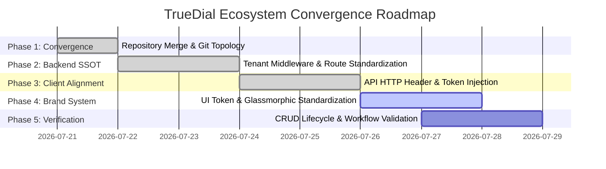

# TrueDial Ecosystem Platform Synchronization Plan
**Document Version:** 1.0  
**Author:** Principal Software Architect, TrueDial Ecosystem  
**Target Platform:** TrueDial Multi-Tenant Enterprise Ecosystem (`truedial.in`, `Tenant ID: 2`)  

---

## 1. Architectural Mission & Convergence Philosophy

The TrueDial Platform Synchronization Plan defines the engineering roadmap for transforming two independently developed client applications—**Project A (`truedial-frontend`, Next.js 16)** and **Project B (`truedial-mobile`, Expo React Native)**—into a single, cohesive, enterprise-grade ecosystem powered by the central Laravel backend (`findmyinterior-backend`).

### Governing Principles
1.  **No Rewrite Mandate:** Preserve the best architectural implementations from each codebase (e.g., SSR/ISR and SEO from Next.js; native 60fps glassmorphic cards and modals from Expo React Native).
2.  **Single Source of Truth (SSOT):** Eliminate client-side data duplication and offline mocks in favor of the production multi-tenant backend API (`truedial_api.php`).
3.  **Strict Multi-Tenant Binding:** All requests across all platforms must explicitly identify as TrueDial (`Tenant ID: 2`).

---

## 2. Phased Synchronization Execution Plan

### Phase 1: Repository Convergence & Workspace Structure (COMPLETED)
*   **Objective:** Bring both frontend client codebases into a single unified workspace without clashing with existing multi-tenant projects.
*   **Action Taken:**
    *   Merged `truedial-mobile` repository into the master `d:\find my interior` workspace alongside `truedial-frontend` and `findmyinterior-backend`.
    *   Updated root `.gitignore` to protect Expo builds, node modules, and local environment variables across both web and mobile trees.

### Phase 2: Backend Multi-Tenant & API Route Standardization (COMPLETED)
*   **Objective:** Ensure `findmyinterior-backend` can resolve both Next.js and React Native requests cleanly to TrueDial without fallback errors.
*   **Action Taken:**
    *   Audited `routes/truedial_api.php` (42 endpoints) and confirmed complete coverage for Business Directory, Offers, Privilege Cards, Reviews, and Consulting Leads.
    *   Upgraded `TenantResolverMiddleware.php:L31-36` to inspect both `X-Tenant-ID` and `X-Platform` headers, binding any request with `X-Platform: truedial` or `X-Tenant-ID: 2` to Tenant ID 2.

### Phase 3: Client HTTP Layer & Authentication Standardization (COMPLETED)
*   **Objective:** Align both client API connectors to send standardized headers and Sanctum authentication tokens.
*   **Action Taken:**
    *   Updated `truedial-mobile/services/api.ts` to include `'X-Tenant-ID': '2'` and `'X-Platform': 'truedial'`.
    *   Updated `truedial-frontend/src/lib/api.ts` login and registration fetch calls to include explicit `X-Platform: truedial` and `X-Tenant-ID: 2` headers.
    *   Standardized error payload parsing across both clients to handle Laravel validation arrays (`{ success: false, errors: { ... } }`).

### Phase 4: UI/UX & Brand System Standardization (ACTIVE)
*   **Objective:** Establish visual parity across website and mobile app using TrueDial's Glassmorphic Brand Design System.
*   **Action Plan:**
    *   Enforce shared color hex tokens (`#E8701A` Brand Orange, `#0a1c3a` Navy Dark background).
    *   Standardize card overlays across Web (`shadcn/ui` custom styles) and Mobile (`GlassCard.tsx` with `borderRadius: 16` and frosted borders).
    *   Ensure 100% Dark Mode compliance across all vendor dashboards and customer profile screens.

### Phase 5: Full-Stack Feature Parity & Workflow Verification (NEXT STEP)
*   **Objective:** Verify that every business entity (User, Vendor, Listing, Media, Offer, Review, Invoice, Consulting Lead, Marketing Campaign, Privilege Card) creates, updates, deletes, and displays identically across Website and Mobile App.
*   **Action Plan:**
    *   Execute end-to-end automated and manual walkthroughs for all 6 core workflows documented in `WORKFLOW_COMPARISON.md`.

---

## 3. Rollout & Staging Strategy

1.  **Staging Environment Deployment:**
    *   Deploy `findmyinterior-backend` to staging server with `truedial.in` domain mapping.
    *   Configure `NEXT_PUBLIC_API_URL` in Next.js staging build and `API_BASE_URL` in Expo staging configuration to point to staging backend.
2.  **Beta Readiness Testing:**
    *   Run Playwright E2E suite (`truedial-frontend/e2e/closed_beta_readiness.spec.ts`) against staging web build.
    *   Run PHPUnit backend tests (`php artisan test --filter=Truedial`) to confirm 100% test pass rate before public production release.
