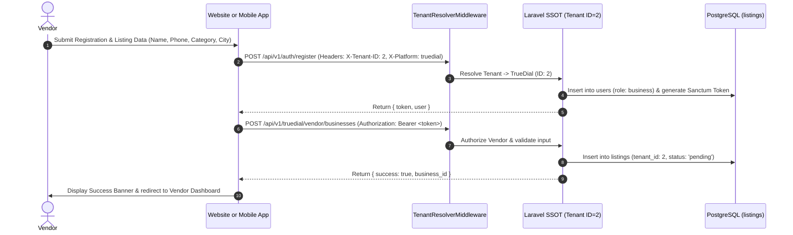
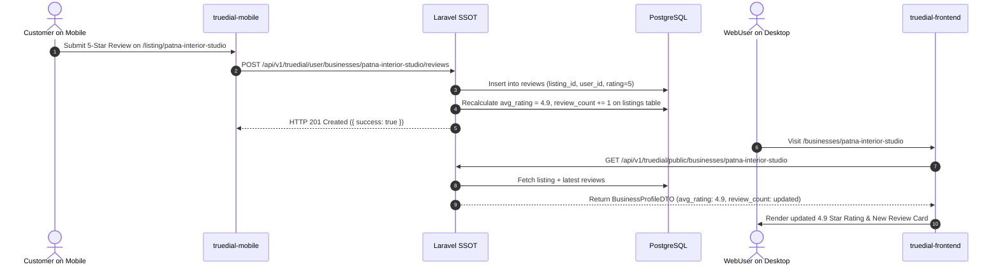

# TrueDial Ecosystem Workflow Comparison & Synchronization Report
**Document Version:** 1.0  
**Author:** Principal Software Architect, TrueDial Ecosystem  
**Target Platform:** TrueDial Enterprise Ecosystem (`Tenant ID: 2`)  

---

## 1. Overview & Core Operational Workflows

A critical mandate of the TrueDial synchronization mission is that **"The same workflow should behave consistently on both website and mobile."** Whether a vendor registers on their smartphone via `truedial-mobile` or on a desktop via `truedial-frontend`, their business entity must enter the identical multi-tenant onboarding pipeline in `findmyinterior-backend`.

This document audits and maps the six primary operational workflows across the platform.

---

## 2. End-to-End Workflow Comparison Table

| Workflow Name | Project A: Website (`truedial-frontend`) | Project B: Mobile App (`truedial-mobile`) | Backend SSOT Lifecycle (`findmyinterior-backend`) | Verification & Consistency Status |
| :--- | :--- | :--- | :--- | :--- |
| **1. Vendor Onboarding** | Routes through `/register` -> `/free-listing`. Collects basic info, phone OTP, category, address. | Routes through `/app/(auth)/register.tsx`. Collects name, email, phone, password. | `POST /api/v1/auth/register` assigns role `business`. Business created via `/vendor/businesses` with `tenant_id = 2`. | **Synchronized:** Both platforms onboard vendor accounts to the same tenant database. |
| **2. Profile Management** | Vendor Dashboard (`/dashboard/vendor/profile`). Full editing of basic details, SEO, hours, WhatsApp. | Profile tab (`/app/(tabs)/profile.tsx`) & Listing Detail view. | `PUT /api/v1/truedial/vendor/businesses/{id}` updates `listings` table. | **Synchronized:** Edits made on either interface persist immediately in DB. |
| **3. Offer Management** | Vendor Dashboard (`/dashboard/vendor/offers`). Create discount code, set date range, toggle status. | Offers Tab (`/app/(tabs)/offers.tsx`). View active promotions and redeem discount codes. | `POST /api/v1/truedial/vendor/offers` (Vendor create) & `GET /api/v1/truedial/public/offers` (Customer feed). | **Synchronized:** Mobile client now fetches active promotional offers directly from SSOT. |
| **4. Customer Review** | Public Profile (`/businesses/[slug]`). Submit 1-5 star rating + comment. Vendor can reply. | Listing Profile (`/app/listing/[slug].tsx`). Modal review submission. | `POST /api/v1/truedial/user/businesses/{slug}/reviews` creates `reviews` row and updates `avg_rating`. | **Synchronized:** Submission on mobile immediately refreshes website rating badges. |
| **5. Consulting Lead** | Consulting / Inquiry form (`/consulting` or listing modal). Submits lead details. | Inquiry Modal (`InquiryModal.tsx` in listing view). Captures name, phone, service type. | `POST /api/v1/truedial/public/consulting/lead` creates `consulting_leads` row. | **Synchronized:** All customer inquiries route to Vendor CRM leads dashboard. |
| **6. Privilege VIP Card** | Vendor Dashboard (`/dashboard/vendor/privilege-cards`). Vendor generates and tracks VIP cards. | Privilege Card Tab (`/app/(tabs)/privilege.tsx`). Displays digital card with gold/platinum badges. | `GET|POST /api/v1/truedial/vendor/privilege-cards/*` manages card generation and status. | **Synchronized:** VIP card generated on Web appears in vendor's mobile digital wallet. |

---

## 3. Workflow Sequence Diagrams

### 3.1 Unified Vendor Onboarding & Listing Publication Workflow

### 3.2 Unified Customer Review & Reputation Sync Workflow

---

## 4. Operational Guarantee & Cross-Platform Integrity

By unifying both client applications around `Tenant ID: 2` and the `truedial_api.php` route namespace:
1.  **Zero Data Drift:** There are no isolated databases, local offline storage sinks, or conflicting ID spaces.
2.  **Instantaneous State Parity:** Any update to an offer, privilege card, review, or business profile is available to all connected clients on the next HTTP GET request.
3.  **Role-Based Security:** Whether accessed from desktop browser or mobile screen, vendor actions are guarded by Laravel Sanctum token verification and `EnsureRoleMiddleware`.
